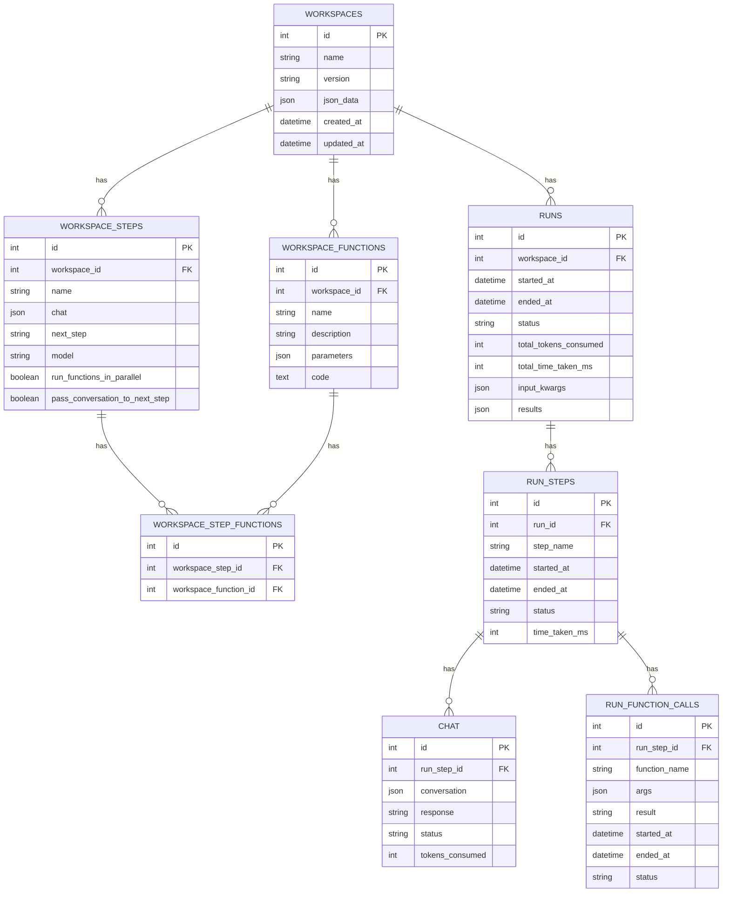

```mermaid
erDiagram
    WORKSPACES {
        int id PK
        string name
        string version
        json json_data
        datetime created_at
        datetime updated_at
    }
    WORKSPACE_FUNCTIONS {
        int id PK
        int workspace_id FK
        string name
        string description
        json parameters
        text code
    }
    WORKSPACE_STEPS {
        int id PK
        int workspace_id FK
        string name
        json chat
        string next_step
        string model
        boolean run_functions_in_parallel
        boolean pass_conversation_to_next_step
    }
    WORKSPACE_STEP_FUNCTIONS {
        int id PK
        int workspace_step_id FK
        int workspace_function_id FK
    }
    RUNS {
        int id PK
        int workspace_id FK
        datetime started_at
        datetime ended_at
        string status
        int total_tokens_consumed
        int total_time_taken_ms
        json input_kwargs
        json results
    }
    RUN_STEPS {
        int id PK
        int run_id FK
        string step_name
        datetime started_at
        datetime ended_at
        string status
        int time_taken_ms
    }
    CHAT {
        int id PK
        int run_step_id FK
        json conversation
        string response
        string status
        int tokens_consumed
    }
    RUN_FUNCTION_CALLS {
        int id PK
        int run_step_id FK
        string function_name
        json args
        string result
        datetime started_at
        datetime ended_at
        string status
    }

    WORKSPACES ||--o{ WORKSPACE_FUNCTIONS : has
    WORKSPACES ||--o{ WORKSPACE_STEPS : has
    WORKSPACE_STEPS ||--o{ WORKSPACE_STEP_FUNCTIONS : has
    WORKSPACE_FUNCTIONS ||--o{ WORKSPACE_STEP_FUNCTIONS : has
    WORKSPACES ||--o{ RUNS : has
    RUNS ||--o{ RUN_STEPS : has
    RUN_STEPS ||--o{ CHAT : has
    RUN_STEPS ||--o{ RUN_FUNCTION_CALLS : has
```