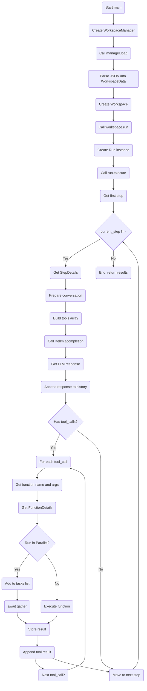

```mermaid
graph TD
A(Start main) --> B(Create WorkspaceManager)
B --> C(Call manager.load)
C --> D(Parse JSON into WorkspaceData)
D --> E(Create Workspace)
E --> F(Call workspace.run)
F --> G(Create Run instance)
G --> H(Call run.execute)
H --> I(Get first step)
I --> J{current_step != -}
J -->|Yes| K(Get StepDetails)
K --> L(Prepare conversation)
L --> M(Build tools array)
M --> N(Call litellm.acompletion)
N --> O(Get LLM response)
O --> P(Append response to history)
P --> Q{Has tool_calls?}
Q -->|Yes| R(For each tool_call)
R --> S(Get function name and args)
S --> T(Get FunctionDetails)
T --> U{Run in Parallel?}
U -->|Yes| V(Add to tasks list)
U -->|No| W(Execute function)
V --> X(await gather)
W --> Y(Store result)
X --> Y
Y --> Z(Append tool result)
Z --> AA(Next tool_call?)
AA --> R
Q -->|No| AB(Move to next step)
Z --> AB
AB --> J
J -->|No| AC(End, return results)
```