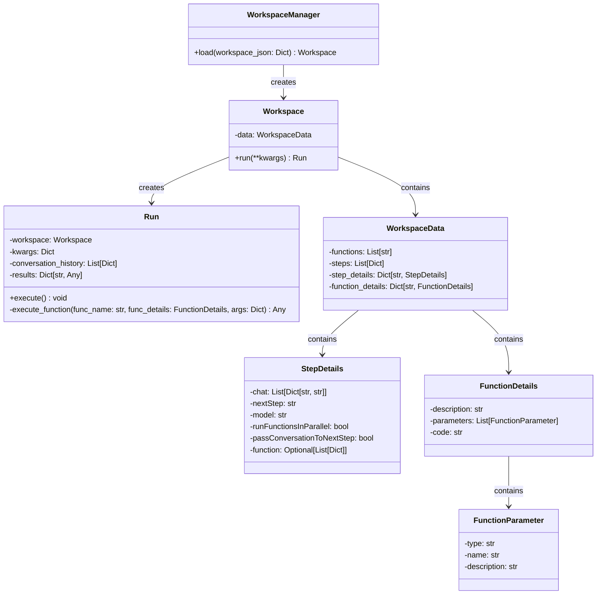

```mermaid
classDiagram
    class WorkspaceManager {
        +load(workspace_json: Dict) Workspace
    }

    class Workspace {
        -data: WorkspaceData
        +run(**kwargs) Run
    }

    class Run {
        -workspace: Workspace
        -kwargs: Dict
        -conversation_history: List[Dict]
        -results: Dict[str, Any]
        +execute() void
        -execute_function(func_name: str, func_details: FunctionDetails, args: Dict) Any
    }

    class WorkspaceData {
        -functions: List[str]
        -steps: List[Dict]
        -step_details: Dict[str, StepDetails]
        -function_details: Dict[str, FunctionDetails]
    }

    class StepDetails {
        -chat: List[Dict[str, str]]
        -nextStep: str
        -model: str
        -runFunctionsInParallel: bool
        -passConversationToNextStep: bool
        -function: Optional[List[Dict]]
    }

    class FunctionDetails {
        -description: str
        -parameters: List[FunctionParameter]
        -code: str
    }

    class FunctionParameter {
        -type: str
        -name: str
        -description: str
    }

    WorkspaceManager --> Workspace : creates
    Workspace --> Run : creates
    Workspace --> WorkspaceData : contains
    WorkspaceData --> StepDetails : contains
    WorkspaceData --> FunctionDetails : contains
    FunctionDetails --> FunctionParameter : contains
```
